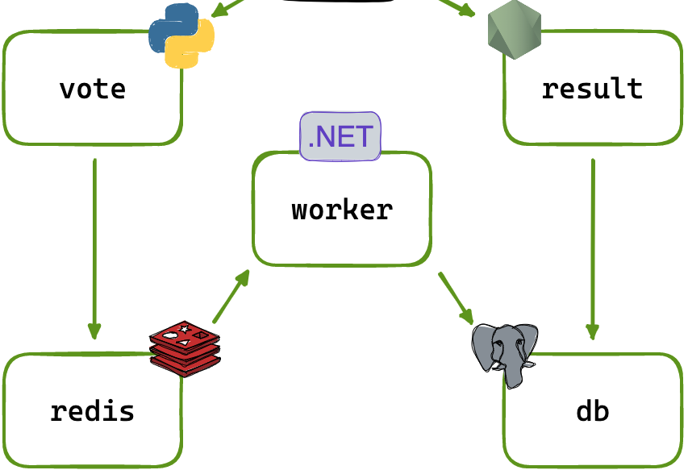

# Voting-app

*  front-end web app in [Python](/frontend/vote-app) which lets you vote between two options
*  [Redis](https://hub.docker.com/_/redis/) which collects new votes
*  [.NET](/backend/worker) worker which consumes votes and stores them
*  [Postgres](https://hub.docker.com/_/postgres/) database backed by a Docker volume
*  [Node.js](/frontend/result-app) web app which shows the results of the voting in real time

The voting application only accepts one vote per client browser. It does not register additional votes if a vote has already been submitted from a client.

